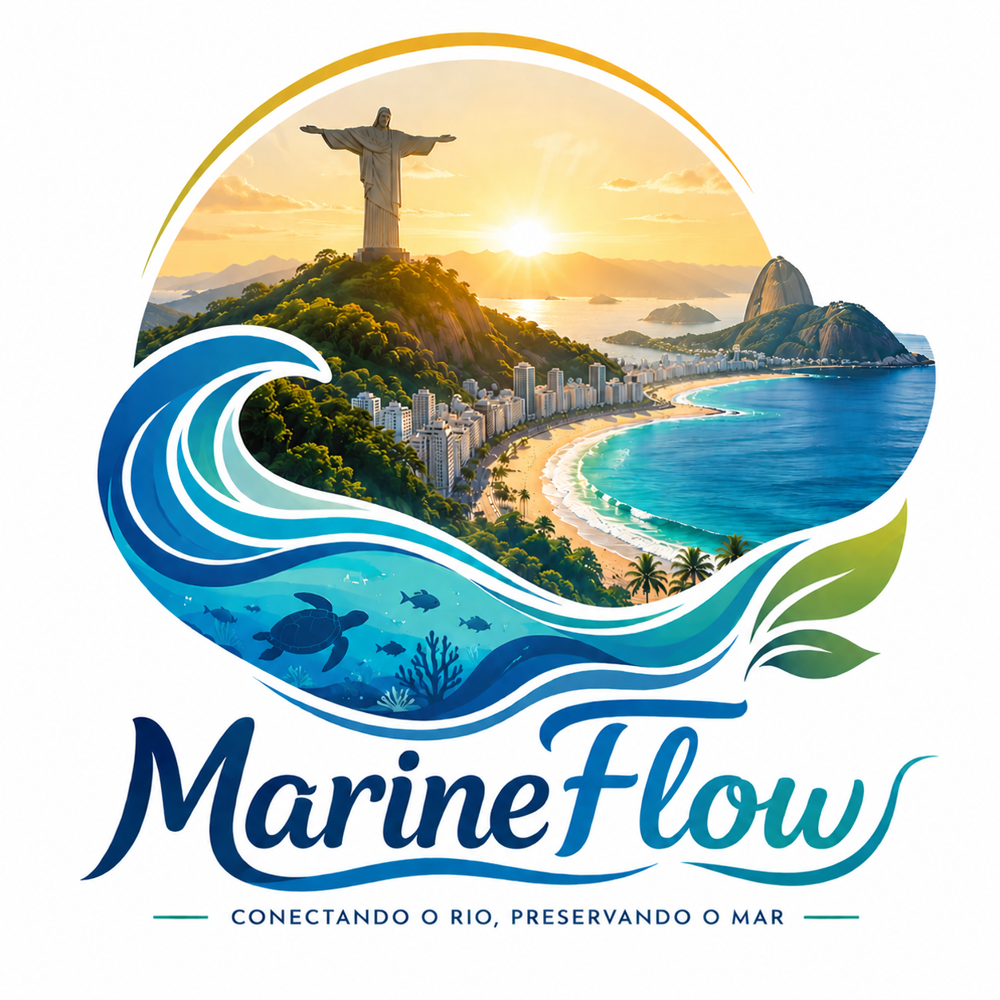
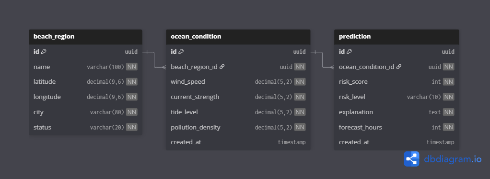

<div align="center">
  

  <p><strong>Plataforma preditiva de monitoramento costeiro</strong></p>
  <p>Previsão de acúmulo de resíduos marinhos no litoral do Rio de Janeiro</p>

  
  
  
  
  
  
</div>

---

## 📋 Sobre o projeto

O MarineFlow é uma plataforma que antecipa regiões costeiras do Rio de Janeiro com maior risco de acúmulo de resíduos marinhos nas próximas **24h, 48h ou 72h**.

O lixo marinho hoje é tratado de forma **reativa** — quando os resíduos já chegaram às praias. O MarineFlow vira esse jogo: através de variáveis ambientais simuladas (vento, maré, corrente, densidade de poluição), o sistema calcula um **score de risco (0–100)** e gera uma justificativa ambiental para apoiar equipes de limpeza, ONGs e órgãos ambientais em ações **preventivas**.

> **MVP:** Sem satélites, sensores reais ou IA — simulação manual com regras de negócio bem definidas. O foco é na arquitetura e na experiência de uso.

---

## 🚀 Stack

| Camada | Tecnologia |
|---|---|
| Frontend | React 18 + Vite + TypeScript + Tailwind CSS |
| API | Node.js + Fastify + TypeScript |
| Arquitetura API | SOLID + Arquitetura Hexagonal (Ports & Adapters) |
| Banco de Dados | PostgreSQL 16 |
| Infraestrutura | Docker + Docker Compose |

---

## 🏗️ Arquitetura

A API segue o padrão **Hexagonal (Ports & Adapters)**, mantendo o domínio completamente isolado de frameworks e infraestrutura.

```
api/src/
├── domain/
│   ├── entities/          # BeachRegion, OceanCondition, Prediction
│   ├── ports/
│   │   ├── in/            # interfaces dos casos de uso
│   │   └── out/           # interfaces dos repositórios
│   └── services/          # RiskCalculatorService (lógica pura)
├── application/
│   └── use-cases/         # CreateSimulation, GetPredictionHistory
├── infrastructure/
│   ├── http/
│   │   ├── routes/        # rotas Fastify
│   │   └── controllers/   # controllers HTTP
│   └── database/
│       └── repositories/  # implementações PostgreSQL
└── shared/
    └── errors/            # erros de domínio
```

### Princípios SOLID aplicados

| Princípio | Aplicação |
|---|---|
| **S** — Single Responsibility | Cada classe tem uma única responsabilidade |
| **O** — Open/Closed | Casos de uso abertos para extensão, fechados para modificação |
| **L** — Liskov Substitution | Repositórios substituíveis sem quebrar o domínio |
| **I** — Interface Segregation | Ports separadas por contexto (`in/` e `out/`) |
| **D** — Dependency Inversion | Domínio depende de abstrações, nunca de implementações concretas |

---

## 📐 Modelagem de dados



---

## ⚖️ Regras de negócio

| Regra | Descrição |
|---|---|
| BR-01 | Score de risco varia entre **0 e 100** |
| BR-02 | Score < 40 → risco **baixo** 🟢 |
| BR-03 | Score 40–69 → risco **médio** 🟡 |
| BR-04 | Score ≥ 70 → risco **alto** 🔴 |
| BR-05 | Maré alta **aumenta** o risco |
| BR-06 | Correntes fortes **aumentam** a probabilidade de acúmulo |

---

## 🧮 Fórmula de cálculo do score

```text
score = round( windScore×0.20 + currentScore×0.30 + tideScore×0.30 + pollutionScore×0.20 )

┌─────────────────────┬────────────────────────────────────────────┬────────┐
│ Fator               │ Normalização (0–100)                       │ Peso   │
├─────────────────────┼────────────────────────────────────────────┼────────┤
│ windScore           │ clamp(windSpeed / 30,      0, 1) × 100     │  20%   │
│ currentScore        │ clamp(currentStrength / 5, 0, 1) × 100     │  30%   │
│ tideScore           │ clamp(max(0, tideLevel) / 3, 0, 1) × 100   │  30%   │
│ pollutionScore      │ clamp(pollutionDensity / 100, 0, 1) × 100  │  20%   │
└─────────────────────┴────────────────────────────────────────────┴────────┘

Fatores com score ≥ 50 são listados na explicação gerada (máx. 2 dominantes).
```

---

## 🔄 Fluxo de simulação

```text
   POST /simulations
          │
          ▼
┌───────────────────────┐
│  SimulationController │  valida e adapta HTTP → domínio
└──────────┬────────────┘
           │
           ▼
┌───────────────────────────┐
│  CreateSimulationUseCase  │  orquestra o fluxo completo
└──┬────────────────────┬───┘
   │                    │
   ▼                    ▼
┌──────────────────┐  ┌────────────────────────┐
│ BeachRegion      │  │  RiskCalculatorService │
│ Repository (out) │  │  (serviço de domínio)  │
│                  │  │  → score + level +     │
│ findById()       │  │    explanation         │
└──────────────────┘  └───────────┬────────────┘
   404 se não existe              │
                                  ▼
                       ┌──────────────────────┐
                       │  Prediction          │
                       │  Repository (out)    │
                       │  save()              │
                       └──────────┬───────────┘
                                  │
                                  ▼
                           Response 201
                       { predictionId, riskScore,
                         riskLevel, explanation,
                         forecastHours, createdAt }
```

---

## 🔌 Endpoints da API

| Método | Rota | Descrição |
|---|---|---|
| `GET` | `/health` | Health check |
| `GET` | `/beach-regions` | Lista todas as regiões costeiras |
| `POST` | `/simulations` | Cria simulação e retorna predição de risco |
| `GET` | `/simulations/:beachRegionId/history` | Histórico de predições da região |

### Exemplo — POST /simulations

```json
// Request
{
  "beachRegionId": "uuid-da-praia",
  "windSpeed": 45,
  "currentStrength": 7.5,
  "tideLevel": 8.2,
  "pollutionDensity": 6.0,
  "forecastHours": 24
}

// Response
{
  "id": "uuid-da-predicao",
  "riskScore": 82,
  "riskLevel": "high",
  "explanation": "Risco elevado devido à combinação de maré alta, forte corrente marítima e alta densidade de resíduos.",
  "forecastHours": 24,
  "createdAt": "2026-06-16T22:00:00.000Z"
}
```

---

## ⚡ Como rodar

### Pré-requisitos

- [Node.js 18+](https://nodejs.org/)
- [pnpm 9+](https://pnpm.io/) — instale com `npm install -g pnpm` se não tiver
- [Docker](https://www.docker.com/) e Docker Compose — precisa estar **em execução** antes do passo 3

Confira as versões instaladas:

```bash
node -v
pnpm -v
docker -v
```

### 1. Baixe o projeto (clone)

```bash
git clone https://github.com/andre-0303/marine-flow.git
cd marine-flow
```

### 2. Configure as variáveis de ambiente

```bash
cp .env.example .env
```

O arquivo `.env` controla a `DATABASE_URL` usada pela API — os valores padrão já funcionam com o `docker-compose.yml` deste projeto, sem precisar editar nada.

### 3. Instale as dependências (raiz do monorepo)

```bash
pnpm install
```

### 4. Suba o banco de dados

```bash
docker compose up -d
```

> As migrations e o seed são executados automaticamente pelo PostgreSQL na primeira vez que o container sobe.

### 5. Rode a API

```bash
pnpm dev:api
```

### 6. Rode o frontend (em outro terminal)

```bash
pnpm dev:web
```

### 7. Verifique se funcionou

- API: `curl http://localhost:3333/health` deve responder com status `ok`
- Frontend: abra [http://localhost:5173](http://localhost:5173) no navegador

A API estará disponível em `http://localhost:3333` e o frontend em `http://localhost:5173`.

### Problemas comuns

| Sintoma | Causa provável | Solução |
|---|---|---|
| `ECONNREFUSED` ao chamar a API | Banco de dados não está de pé | Verifique `docker ps` e rode `docker compose up -d` |
| Porta `3333` ou `5173` já em uso | Outro processo usando a porta | Encerre o processo ou altere a porta em `vite.config.ts` / `.env` |
| `pnpm: command not found` | pnpm não instalado globalmente | `npm install -g pnpm` |
| Frontend não pega cor/estilo novo | Cache do Vite após editar `tailwind.config.js` | Reinicie `pnpm dev:web` |

---

## 🧪 Testes

### Testes unitários

Cobrem domínio e casos de uso sem banco de dados. Rodam em ~100ms.

```bash
pnpm --filter @marine-flow/api test
```

| Suite | Camada | Casos |
|---|---|---|
| `BeachRegion` | Domain — entidade | 14 |
| `OceanCondition` | Domain — entidade | 8 |
| `Prediction` | Domain — entidade | 15 |
| `RiskCalculatorService` | Domain — serviço | 12 |
| `CreateSimulationUseCase` | Application | 6 |
| `GetPredictionHistoryUseCase` | Application | 5 |

### Testes E2E

Testam a stack completa via HTTP (Fastify `inject`) com banco de dados real. Requerem PostgreSQL em execução.

```bash
# certifique-se que o banco está no ar
docker compose up -d

pnpm --filter @marine-flow/api test:e2e
```

| Suite | Endpoint | Casos |
|---|---|---|
| `health` | `GET /health` | 1 |
| `beachRegions` | `GET /beach-regions` | 2 |
| `simulations` | `POST /simulations` + `GET /simulations/:id/history` | 11 |

Os testes E2E criam e removem automaticamente dados de teste no banco (usando UUID fixo `00000000-0000-0000-0000-0000000000e2`). Dados de produção não são afetados.

---

## 📁 Estrutura do monorepo

```
marine-flow/
├── api/               # Node.js + Fastify + TypeScript
├── web/               # React + Vite + TypeScript
├── docker-compose.yml
├── .env.example
└── README.md
```

---

## 👥 Stakeholders

- Prefeitura do Rio de Janeiro
- ONGs ambientais
- Equipes de limpeza urbana
- Pesquisadores ambientais
- Setor de turismo local

---

<div align="center">
  <p>Desenvolvido por <a href="https://github.com/andre-0303">André Bandeira</a></p>
</div>
